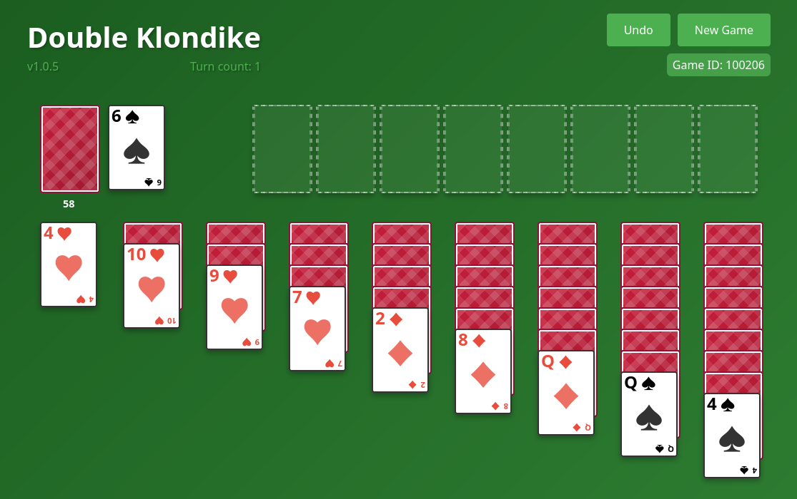

# Double Klondike

Klondike card game with 2 decks

https://sean5446.github.io/2klondike/

## Running Locally

**Prerequisites:** Node.js 22+

```bash
npm install
npm run dev
```

Then open the local URL shown in the terminal (e.g. `http://localhost:5173`).

## Versioning

The version displayed in the UI is pulled directly from `package.json`. To increment it, run one of:

```bash
npm version patch   # e.g. 1.0.8 → 1.0.9  (bug fixes)
npm version minor   # e.g. 1.0.8 → 1.1.0  (new features)
npm version major   # e.g. 1.0.8 → 2.0.0  (breaking changes)
```


